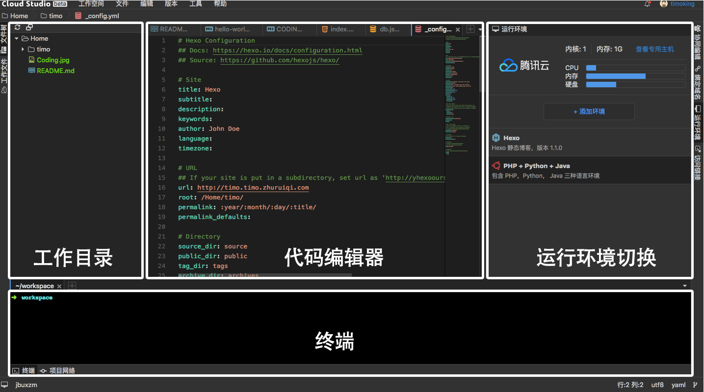

# 环境配置-02

## 1 优先推荐初学者先使用网上环境，而不是本地部署。

[Cloud Studio](https://studio.dev.tencent.com/) 是基于浏览器的集成式开发环境，是腾讯公司的，支持绝大部分编程语言，包括 HTML5、PHP、Python、Java、Ruby、C/C++、.NET 等等，无需下载安装程序，一键切换开发环境。 [Cloud Studio](https://studio.dev.tencent.com/) 提供了完整的 Linux 环境，并且支持自定义域名指向，动态计算资源调整，可以完成各种应用的开发编译与部署。

